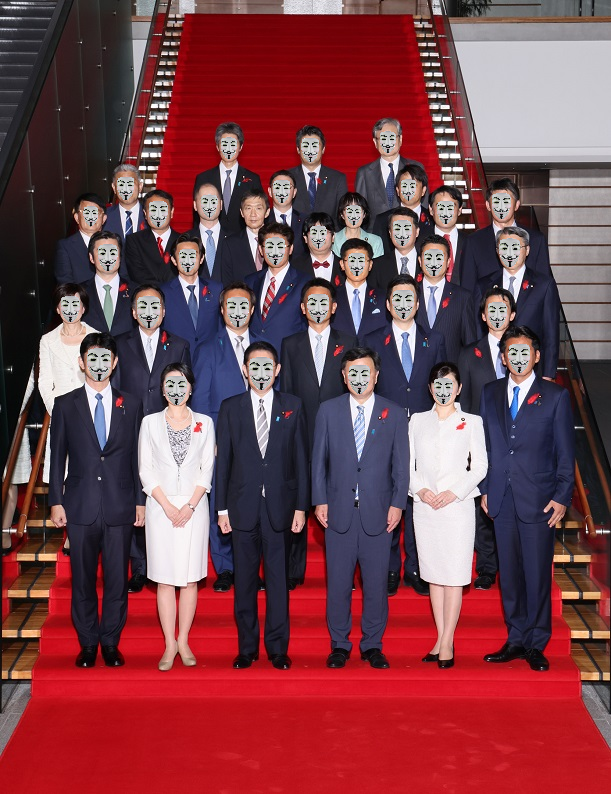

# opencv-anonymousface



By [首相官邸](https://www.kantei.go.jp/jp/100_kishida/meibo/seimukan.html)

# First

[mattnさんのoracle-cloud-function-anonymousface](https://github.com/mattn/oracle-cloud-function-anonymousface)に影響を受けて作成しました。

# Usage
```
dot run test\20211006seimukan01.jpg test\masked.png
```

# Installation

```
git clone git@github.com:PenguinCabinet/opencv-anonymousface.git
```
実行ファイルでの配布は現在準備中

# License
MIT \
[顔認識にOpenCVとそのモデルを使用しています](https://github.com/opencv/opencv)

# Todo
* 顔認識のscaleFactorをCliオプションとして変更できるようにする