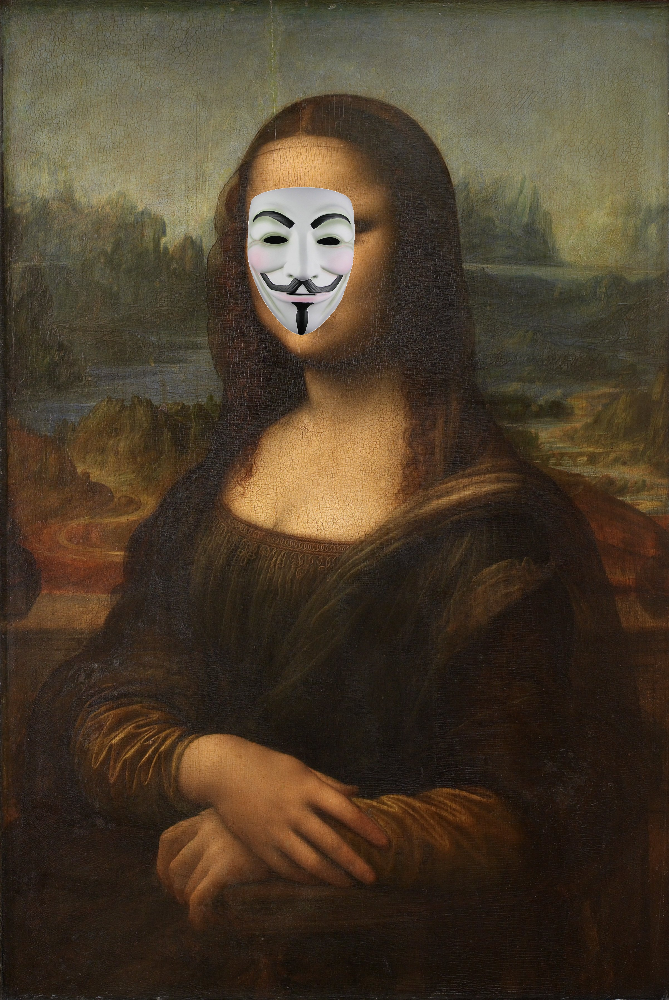

# opencv-anonymousface

   

By [wikipedia](https://ja.wikipedia.org/wiki/%E3%83%A2%E3%83%8A%E3%83%BB%E3%83%AA%E3%82%B6#/media/%E3%83%95%E3%82%A1%E3%82%A4%E3%83%AB:Leonardo_da_Vinci_-_Mona_Lisa.jpg)    
Public LICENSE   

# First

[mattnさんのoracle-cloud-function-anonymousface](https://github.com/mattn/oracle-cloud-function-anonymousface)に影響を受けて作成しました。   
顔を自動検出し、アノニマスのお面をかぶせるツールです。

# Usage
```
dotnet run .\test\img.jpg  .\test\masked_img.jpg      
```

# Installation

```
git clone git@github.com:PenguinCabinet/opencv-anonymousface.git
```
実行ファイルでの配布は現在準備中

# License
MIT    
[顔認識にOpenCVとそのモデルを使用しています](https://github.com/opencv/opencv)    
[data/mask.pngはmattnさんのリポジトリから派生したものです。](https://github.com/mattn/oracle-cloud-function-anonymousface)   
このリポジトリに関して、一切の責任を負いません。

# Todo
* 顔認識のscaleFactorをCliオプションとして変更できるようにする
